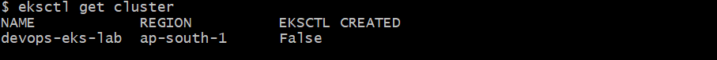
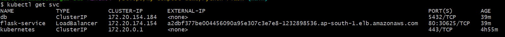
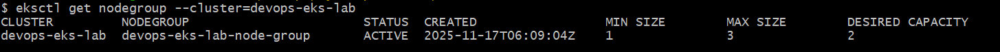
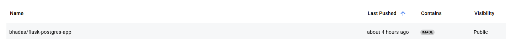

# Cloud-Native DevOps Project: Flask + Postgres + Redis on AWS EKS

## Overview
This project demonstrates a complete DevOps pipeline:
- **Infrastructure as Code** (Terraform) to provision AWS EKS
- **Containerized Python (Flask) app** with Postgres and Redis
- **Kubernetes manifests** for microservice deployment
- **CI/CD (GitHub Actions)** for automated Docker build & K8s rollout

---

## Architecture


User -> [LoadBalancer Service] ---> [Flask Pods] ---> [Postgres Service] ---> [Redis Service]

---

## Features

- Multi-container application (Flask, Postgres, Redis)
- Production-ready Docker and Kubernetes configuration
- Declarative, reproducible infrastructure and deployment
- Real-world troubleshooting and best practices

---

## Quick Start

### 1. Build & Push Docker Image

```sh
docker build -t <dockerhub-username>/flask-postgres-app:latest ./app
docker push <dockerhub-username>/flask-postgres-app:latest
```
## If dont want to create you can use my image ```bhadas/flask-postgres-app:latest```



### 2. Provision EKS with Terraform

```sh
cd terraform
terraform init
terraform fmt -check
terraform plan
terraform apply
```
- `Validate cluster and node group status` 



### 3. Deploy to Kubernetes

```sh
kubectl apply -f kubernetes-manifests/
```
### 4. Access the App

- Find the LoadBalancer EXTERNAL-IP with kubectl get svc flask-service



- Visit: `http://<EXTERNAL-IP>/`


